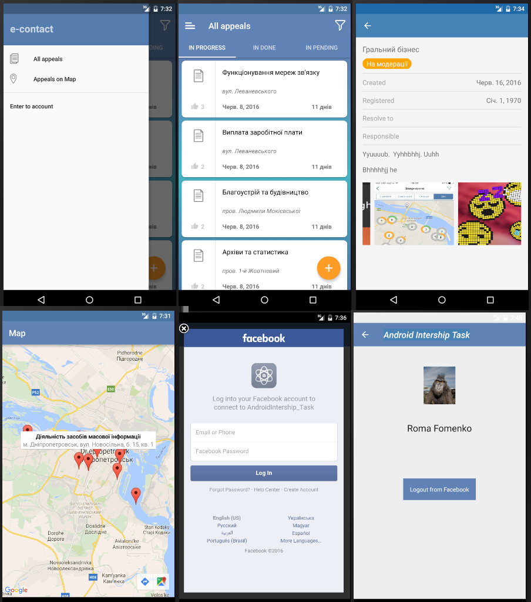
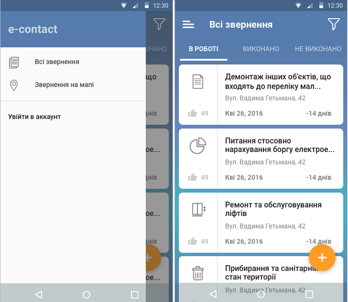
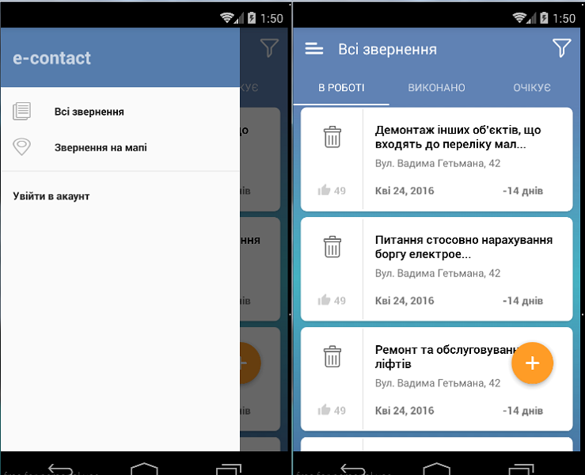
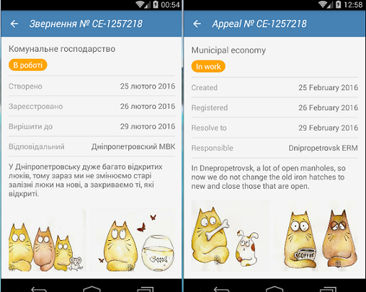

# Android Intership Task3

1. Please use code from 1 and 2 task, and create Client-Server Application. For API request use Retrofit 2.0 from Square. Will be a BIG plus, if you will use RxJava.  
2. You should store whole data in database. It can be realm, native SQL, or sqlbrite. Here you can also use RxJava.
3. When user presses “Enter to the account” please make Facebook login. (with Facebook SDK). You should save profile into db, and save access_token. Also please make simple profile screen with user name and user photos.
4. Please use Butterknife or DataBinding.
Note: Use Butterknife only for views binding or view clicks
5. Please implement MVP architechture into your Application
[Here](https://codelabs.developers.google.com/codelabs/android-testing/index.html?index=../../babbq-2015&viewga=+UA-68632703-1#4) you can read about MVP 
6. Implement recycler view into third tab.

API doc
	
Request:
	
http://dev-contact.yalantis.com/rest/v1/tickets	
	
Also we have here following statuses
	
   IN_PROGRESS  -  state=“0,9,5,7,8”
   DONE - state=”10,6”
   PENDING - state=”1,3,4”

Example:
http://dev-contact.yalantis.com/rest/v1/tickets?state=0,9,5,7,8

Requirments: 
- Put dimens and text sizes into res folder. 
- Don’t use hardcode
- Use google code style !!!!!
- Load data from this api
- On list item click, open first task screen
- Minimal SDK version = 16
- Only portrait orientation

Please don’t commit .idea directory. Use master branch as default. 
Projects that does not use at least one of requirments listed above, will not be checked.

Good luck!)

_________________________________________________________________

This is my version

_________________________________________________________________
_________________________________________________________________
_________________________________________________________________

# Android Intership Task2

Create screen with controls

It should be 3 tabs and Navigation drawer with test data (10 items). 

Requirments: 
- Put dimens and text sizes into res folder. 
- Use google code style !!!!!
- For first and second tab use recyclerview 
- On list item click, open first task screen
- For third tab use listview 
- When user scrolls list, floating action button should hide with animation 
- Use styles 
- Minimal SDK version = 16
- Only portrait orientation

Please don’t commit .idea directory. Use master branch as default. 
Projects that does not use at least one of requirments listed above, will not be checked.

Good luck!)
_________________________________________________________________

This is my version

_________________________________________________________________
_________________________________________________________________
_________________________________________________________________

# Android Intership Task1

Create screen with controls

It should be screen with ScrollView, textviews and  horizontal recycler view with images

Requirments: 
- Put dimens and text sizes into res folder
- Minimal SDK version = 16
- Only portrait orientation
- For image loading use one of third party libraries 
- Support different screen sizes  (from mdpi, only phones)
- Use styles 
- Back button should close application
- Ukrainian and English localization should be included.  
- When user presses any control, show toast with control name
- Project should be pushed into github.com / bitbucket
- Use [google code style](https://source.android.com/source/code-style.html)  
- Also you should find UI mistakes, suggest how to solve it

Good luck!
_________________________________________________________________

This is my version

I think, that possible UI mistakes are:
1) the toolbar title is incomprehensible abbreviation or article. There should be something more informative;
2) the arrow "back button" bigger than needs
3) one divider - paler than the other;
4) the gaps between the dividers not the same size;
5) the page content have text data on Russian and Ukrainian languages at the same time;

